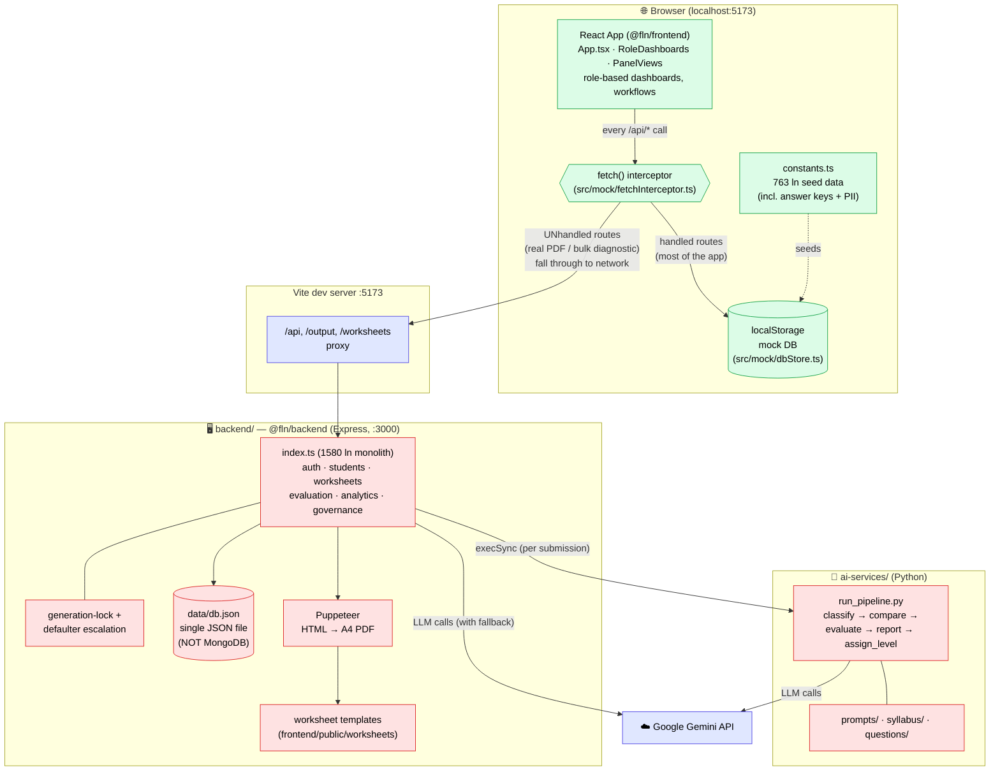
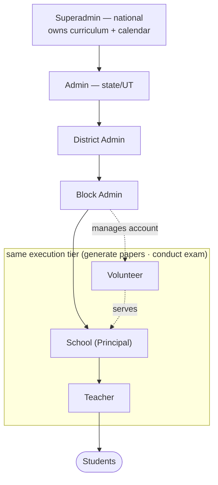
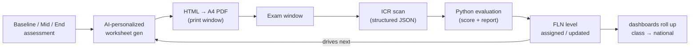
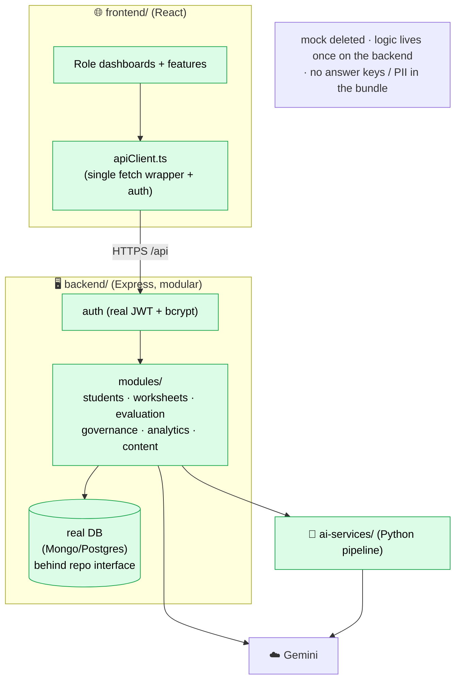

# Architecture

High-level architecture of the FLN platform. See [AUDIT.md](AUDIT.md) for code-health detail and [MIGRATION_PLAN.md](MIGRATION_PLAN.md) for the target direction.

> ⚠️ **Read this first:** the app currently runs on an **in-browser mock backend**, not the real server. Every `/api` call is answered inside the browser from `localStorage`. The real backend exists and works but the UI only reaches it for the few routes the mock doesn't implement (via the Vite proxy). This is the single most important thing to understand about the system today.

---

## 1. Current state (as-is)

**Legend:** 🟢 green = the path the running app actually uses · 🔴 red = real backend, mostly bypassed by the UI · 🟣 purple = external / plumbing.

**Key facts the diagram encodes**
- The **mock interceptor is the de-facto backend.** It serves nearly the whole app from `localStorage`.
- The **real backend is only reached** when the mock doesn't implement a route (e.g. real PDF generation), which then falls through the Vite proxy to `:3000`.
- **Business logic is triplicated** — mock, real backend, and re-computed inside React components — and the copies disagree (e.g. level placement).
- The **"database" is a single JSON file** rewritten per mutation (not concurrency-safe).
- **Auth is not real** — the token is the user's email; role is inferred from the email prefix.

---

## 2. Role hierarchy (domain)

---

## 3. Assessment data flow (per cycle)

---

## 4. Target state (where the migration is headed)

**Deltas from current → target:** delete the mock; frontend talks only to the real backend via `apiClient`; real auth; real database behind a repository interface; the 1580-line `index.ts` split into domain modules; business logic and secrets (answer keys, PII) removed from the frontend.
